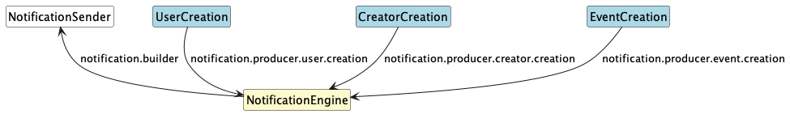
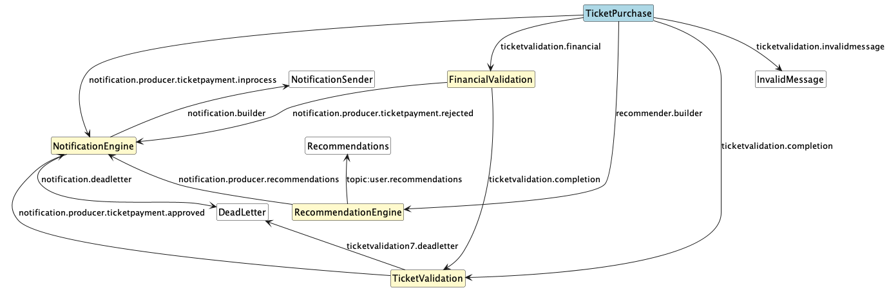
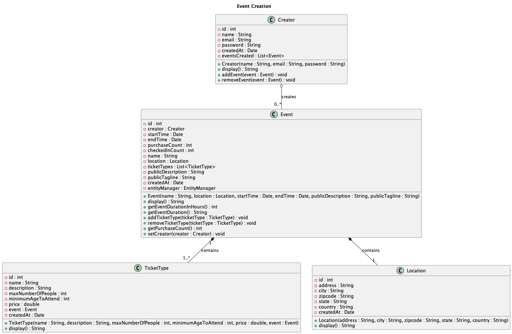
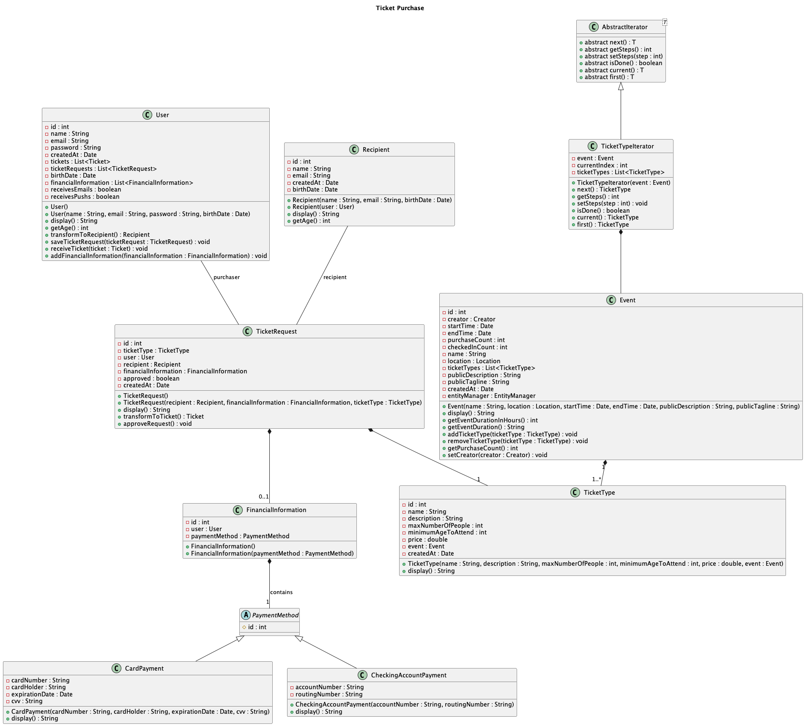
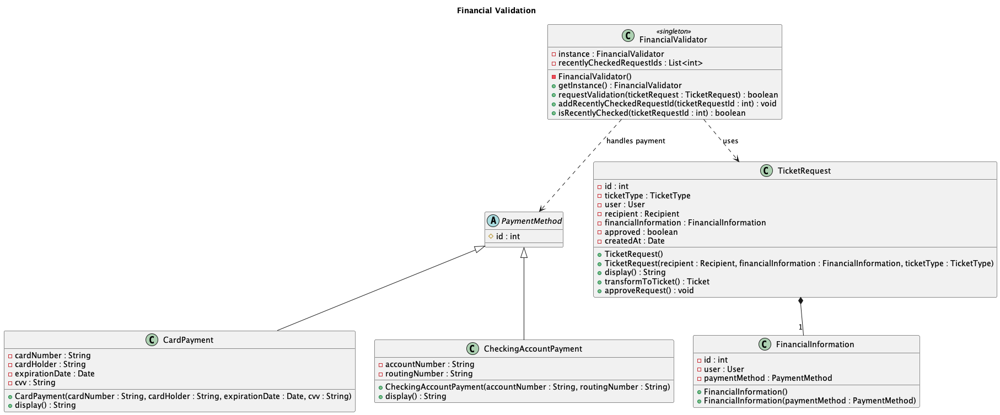
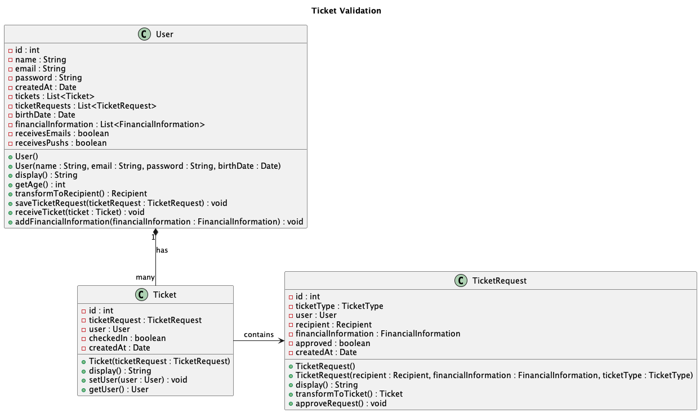
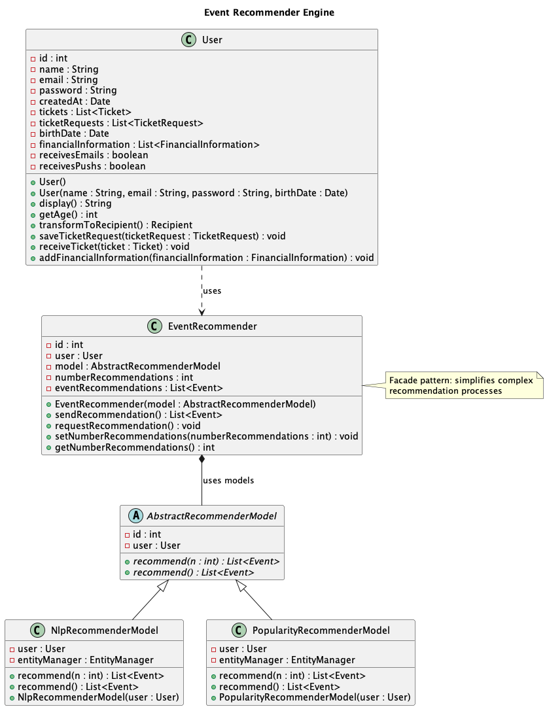

# Event Market - Final Project
**Fernando Urbano Final Project**

# Video Explanation

[](https://www.youtube.com/watch?v=38eP5bMDDyA)

https://www.youtube.com/watch?v=38eP5bMDDyA

# Table of Contents

- [Event Market - Final Project](#event-market---final-project)
- [Video Explanation](#video-explanation)
- [Project Structure](#project-structure)
- [Postgres - Create Database and Database User](#postgres---create-database-and-database-user)
- [Postgres - Create Tables](#postgres---create-tables)
- [Run Camel File](#run-camel-file)
- [Create a New Application](#create-a-new-application)
- [Run All Applications](#run-all-applications)
- [Other Commands](#other-commands)
- [Project Overview and Explanation](#project-overview-and-explanation)
- [Project Separation](#project-separation)
- [Applications](#applications)
- [Design Patterns](#design-patterns)
- [EIP Patterns](#eip-patterns)
- [Design Patterns Code](#design-patterns-code)

# Project Structure
Each of the following is a separate application:
```
.
├── README.md
├── design_patterns.md
├── eip_patterns.md
├── event-market
├── event-market-abstract
├── event-market-event-creation
├── event-market-financial-validation
├── event-market-notification-engine
├── event-market-recommendation-engine
├── event-market-ticket-purchase
├── event-market-ticket-validation
├── event-market-creator-creation
├── event-market-user-creation
└── uml

249 directories, 372 files
```

- `event-market`: main application containing the database and classes.
- `event-market-creator-creation`, `event-market-user-creation`, and `event-market-event-creation`: applications to create instances of User, Creator and Event. Communicates with ActiveMQ via Camel.
- `event-market-ticket-purchase`: application to purchase ticket. Communicates with ActiveMQ via Camel.
- `event-market-notification-engine`: application to notify Users and Creators of new events, ticket purchase, financial validation of ticket purchase, recommendations, etc... Communicates with ActiveMQ via Camel.
- `event-market-financial-validation`, `event-market-ticket-validation`: applicatons to validate ticket purchase. Communicates with ActiveMQ via Camel.
- `event-market-recommendation-engine`: application to create recommendation for User given recent purchases. Communicates with ActiveMQ via Camel.
- `event-market-abstract`: blueprint application to create new applications with default files used for `EventMarketInput.java` and `AbstractCamel.java`.

# Postgres - Create Database and Database User
Download postgres:
```
brew install postgres
```

Inside terminal, enter postgres terminal: 
```
psql postgres
```

Check the existing databases:
```
\l
```

If the `eventmarket_db` does not exist, create it:

```
CREATE DATABASE eventmarket_db;
```

Enter in the newly created database:
```
\c eventmarket_db
```

Check that user `fernandorochacorreaurbano` exists:
```
\du
```

If the user does not exist, create the user:
```
CREATE USER fernandorochacorreaurbano WITH PASSWORD 'fernando123';
```

Grant all the privileges to this user:
```
GRANT ALL PRIVILEGES ON DATABASE eventmarket_db TO fernandorochacorreaurbano;
```

Quit the database:
```
\q
```

If the `eventmarket_test_db` does not exist, create it:

```
CREATE DATABASE eventmarket_test_db;
```

Enter in the newly created database:
```
\c eventmarket_db
```

Check that user `fernandorochacorreaurbano` exists:
```
\du
```

The user should exist, If the user does not exist, check again if the user permissions were applied to the first database.
```
CREATE USER fernandorochacorreaurbano WITH PASSWORD 'fernando123';
```

Grant all the privileges to this user:
```
GRANT ALL PRIVILEGES ON DATABASE eventmarket_db TO fernandorochacorreaurbano;
```

Quit the database:
```
\q
```

It is recommended that you download an extension to be able to visualize the databases. I recommend the "Database" extension from VSCode.

# Postgress - Create Tables
The "DatabaseInitializer" can be used to create the tables that the applications have.

```bash
cd event-market
mvn clean install
mvn exec:java -Dexec.mainClass="eventmarket.main.DatabaseInitializer"
```

If you cannot run the `DatabaseInitializer`, it means there are relationship between classes that are not working well and should be changed. You can see the errors in the terminal.

# Run Camel File
In a general way, running camel file can be achieved by the following command when inside a maven project that contains a pom referencing it:
```bash
mvn exec:java -Dexec.mainClass=camelinaction.FileCopierWithCamel
```

For our applications that communicate with Camel or that take inputs, we create the following shortcuts to run the files:

```bash
mvn exec:java -P run-event-market-input
```

```bash
mvn exec:java -P run-camel
```

Those can be viewed in the pom of each of the applications.

# Create a New Application
1. Copy-paste event-market-abstract

2. If you need an input file, write it at the `src/main/java/eventmarketinput/EventMarketInput.java`. Else, keep it clean.

3. Define the name of your camel class which is located at `src/main/java/camelinaction/AbstractCamel.java`. 

4. Inside the `pom.xml`, change the `artifactId` and `name`:

```xml
  <artifactId>event-market-{change the id here!}</artifactId>
  <groupId>com.camelinaction</groupId>
  <name>Event Market - {Change the name here!}</name>
  <version>1.0.0</version>
```

Change the name of the class used in Camel in the `profiles` part: `<mainClass>camelinaction.UserCreationProducer</mainClass>`.

```xml
  <profiles>
    <profile>
        <id>run-event-market-input</id>
        <properties>
            <mainClass>eventmarketinput.EventMarketInput</mainClass>
        </properties>
    </profile>
    <profile>
        <id>run-camel</id>
        <properties>
            <mainClass>camelinaction.{Change to the name of your Camel file here!}</mainClass>
        </properties>
      </profile>
  </profiles>
```

5. To run the input file:

```bash
mvn exec:java -P run-event-market-input
```

To run camel:

```bash
mvn exec:java -P run-camel
```

# Run All Applications
## 0. SET UP
### 0.0 DATABASE
Create the database as specified before.

### 0.1 EVENT-MARKET
```bash
cd event-market
mvn clean install
cd ..
```

You can now close this terminal. It is important to run the event-market application before running camel applications.

### 0.1. ACTIVEMQ
```bash
activemq console
```

It is important to keep this terminal running at all times.

## 1. ENTITIES CREATION: user-creation & event-creation & creator-creation
### 1.1. TERMINAL notification-engine:
```bash
cd event-market-notification-engine
mvn clean install exec:java -P run-camel
cd ..
```

### 1.2. user-creation
#### 1.2.1 TERMINAL user-creation Camel
```bash
cd event-market-user-creation
mvn clean install exec:java -P run-camel
cd ..
```

#### 1.2.2 TERMINAL user-creation Input
```bash
cd event-market-user-creation
mvn clean install exec:java -P run-event-market-input
cd ..
```

### 1.3. creator-creation
#### 1.3.1 TERMINAL creator-creation Camel
```bash
cd event-market-creator-creation
mvn clean install exec:java -P run-camel
cd ..
```

#### 1.3.2 TERMINAL creator-creation Input
```bash
cd event-market-creator-creation
mvn  clean install exec:java -P run-event-market-input
cd ..
```

### 1.4. event-creation
#### 1.4.1 TERMINAL event-creation Camel
```bash
cd event-market-event-creation
mvn  clean install exec:java -P run-camel
cd ..
```

#### 1.4.2 TERMINAL event-creation Input
```bash
cd event-market-event-creation
mvn clean install exec:java -P run-event-market-input
cd ..
```

## 2. TICKET PURCHASE: ticket-purchase & financial-validation & ticket-validation & recommendation-engine
### 2.1. TERMINAL notification-engine:
```bash
cd event-market-notification-engine
mvn clean install exec:java -P run-camel
cd ..
```

### 2.2. TERMINAL financial-validation:
```bash
cd event-market-financial-validation
mvn clean install exec:java -P run-camel
cd ..
```

### 2.3. TERMINAL ticket-validation:
```bash
cd event-market-ticket-validation
mvn clean install exec:java -P run-camel
cd ..
```

### 2.4. TERMINAL recommendation-engine:
```bash
cd event-market-recommendation-engine
mvn clean install exec:java -P run-camel
cd ..
```

### 2.5. ticket-purchase
#### 2.5.1 TERMINAL ticket-purchase Camel
```bash
cd event-market-ticket-purchase
mvn clean install exec:java -P run-camel
cd ..
```

#### 2.5.2 TERMINAL ticket-purchase Input
```bash
cd event-market-ticket-purchase
mvn clean install exec:java -P run-event-market-input
cd ..
```

# Other commands
## Update puml files
In case modificatons are made in the classes of the `event-market`, it is necessary to update the `puml` files inside the `uml` folder.

After having updated them, run the following script:

```bash
chmod +x update_uml_images.sh # make the script executable in mac
./update_uml_images.sh
```

## Transform latex in markdown
```bash
pandoc -s reports/main.tex -o reports/main.md
```

# Project Overview and Explanation

We aim to build an Event Ticket Purchase Platform, including event
creation, purchase app, notification system, payment validation, event
recommender engine.

In order to facilitate the understanding we highlight the following with
specific formatting:

-   **[Application Names]**

-   ***[Design Patterns]***

-   *[Classes]*

# Project Separation

## Creation Processes



## Ticket Purchase Processes



# Applications

-   Main Application with Database connection:

    -   **[Event Market: event-market]**

-   Creation Camel Applications:

    -   **[Event Creation:
        event-market-event-creation]**

    -   **[User Creation:
        event-market-user-creation]**

    -   **[Creator Creation:
        event-market-event-creation]**

-   Ticket Purchase Camel Applications:

    -   **[Ticket Purchase:
        event-market-ticket-purchase]**

    -   **[Financial Validation:
        event-market-financial-validation]**

    -   **[Ticket Validation:
        event-market-ticket-validation]**

    -   **[Event Recommender Engine:
        event-market-recommendation-engine]**

    -   **[Notification Engine:
        event-market-notification-engine]**

# Design Patterns

## Iterator

-   Inside the **[Ticket Purchase]** app.

-   Iterator pattern is used inside the
    *[TicketTypeIterator]* class to iterate over
    the ticket types of an Event.

-   Provides a convenient way for users to browse through various ticket
    options, helping them understand the minimum age, prices, and types
    of tickets available for an event.

## Singleton

-   Inside the **[Financial Validation]** app.

-   The *[FinancialValidator]* class is a
    Singleton, ensuring that a single instance validates ticket requests
    and manages their statuses.

-   The Singleton pattern allows the
    *[FinancialValidator]* to track which requests
    it has validated recently, avoiding redundant checks and improving
    efficiency.

## Strategy

-   Inside the **[Financial Validation]** app.

-   The *[PaymentMethod]* class acts as a Strategy
    pattern, providing an interface implemented by different payment
    classes such as *[CheckingsAccountPayment]*
    and *[CardPayment]*.

-   This pattern enables the *[Financial
    Validation]* app to support various payment
    methods flexibly, facilitating future additions or modifications by
    simply extending the interface.

## Facade

-   Inside the **[Event Recommender Engine]**.

-   The *[EventRecommender]* class acts as a
    Facade, simplifying the complexity of underlying classes derived
    from the *[AbstractRecommenderModel]*.

-   This pattern allows for interactions with different recommendation
    models, making it easier to generate recommendations for users based
    on recent ticket requests.

## Template Method

-   Inside the **[Event Recommender Engine]**.

-   The Template Method pattern is used by
    *[AbstractRecommenderModel]* and its derived
    classes, implementing some functionalities while leaving the heavy
    lifting to derived classes.

-   This pattern provides a clear structure for creating different
    recommendation models, allowing derived classes to implement the
    specific logic needed to generate suggestions for users.

# Applications and UML Drawings

## Event Creation

App creates a new instances of *[Event]*.

The *[Event]* class has:

-   at least one *[TicketType]* instance: for
    instance, premium, normal, free, etc\... which specifies the price,
    minimum age, total tickets for the type.

-   one *[Location]* instance.

-   one *[Creator]* (each
    *[Creator]* can have multiple events).



THe application communicates with **[Notification
Engine]**.

## User Creation

Similar to the creation of Event. THe application communicates with
**[Notification Engine]**.

## Creator Creation

Similar to the creation of Event. THe application communicates with
**[Notification Engine]**.

## Ticket Purchase

App allows purchase of tickets from *[User]*.

The *[TicketRequest]* is the main class in this
process.

Every *[TicketRequest]* instance has an instance
of:

-   *[TicketType]*: the type of ticket the user is
    buying. A single event allows for multiple
    *[TicketType]*'s with different prices,
    descriptions, etc. A *[TicketRequest]*
    instance only has one *[TicketType]* instance
    among the ones available for the event.

-   *[Financial Information]*: the information
    regarding the payment of the ticket. Each instance of it has one
    instance of a class derived from
    *[PaymentMethod]*, which can be
    *[CheckingsAccountPayment]* or
    *[CardPayment]*. In case the ticket price is
    0, the *[FinancialInformation]* is not
    necessary.

-   *[User]*: the person purchasing the ticket.

-   *[Recipient]*: the person who will enter the
    event. An instance of class *[User]* can be
    transformed into an instance of the class
    *[Recipient]* in case the user is trying to
    buy a ticket for himself/herself.

Once the *[TicketRequest]* is completed, it is
sent to:

-   the **[Financial Validation]** in case a
    payment is necessary.

-   the **[Ticket Validation]** in case no
    payment is necessary.

-   the **[Event Recommender Engine]**
    regardless of payment options.

-   the **[Notification Engine]** to say that
    the ticket is being processed.

Inside the **[Ticket Purchase]** we use the
***[Iterator]*** pattern with
*[TicketTypeIterator]*, which receives an
*[Event]* and iterates over the ticket types. The
iterator is considerably useful for the *[User]*
to understand the minimum age among all the ticket types, the minimum
and maximum price of the event, etc\...

{width="\\textwidth"}

## Financial Validation

App gets messages from the distributed message queue saying that a
*[TicketRequest]* needs payment validation.

Inside the app, The *[TicketRequest]* is sent to
the *[FinancialValidator]* which ask for a payment
process.

The *[FinancialValidator]* is a
***[Singleton]*** because it aims to track which
instances of *[TicketRequest]* it has checked
recently: this allows the *[FinancialValidator]*
to avoid wasting time checking twice the same
*[TicketRequest]*.

The *[TicketRequest]* instance has an instance of
*[FinancialInformation]*, which has one instance
of a class derived from *[PaymentMethod]*.

The available classes are:

-   *[CardPayment]*

-   *[CheckingsAccountPayment]*

*[PaymentMethod]* is a
***[Strategy]*** pattern.

The *[FinancialValidator]* must be able to handle
both classes.

Therefore, if there is an addition/change in those classes, the
*[FinancialValidator]* must be changed/incremented
as well.

Finally, the *[FinancialValidator]* sends a
request to the desired bank to approve the payment (here we simplified
the implementation and just randomly approve or reject the payment).

The application sends message to the

-   the **[Ticket Validation]** in case the
    payment is accepted.

-   the **[Notification Engine]** in case the
    payment is rejected.



## Ticket Validation

App gets messages from the distributed message queue saying that the
ticket for that *[User]* has been approved.

The *[Ticket]* instance is created with a
*[TicketRequest]* instance inside. The
*[TicketRequest]* contains all the information
about the *[Event]* inside it.

The *[Ticket]* instance is added to the
*[User]*. More specifically, the
*[Ticket]* instance is added to a list of owned
tickets and remove the instance of
*[TicketRequest]* from the list of requested
tickets.

Finally, a message is sent to the **[Notification
Engine]**.



## Event Recommender Engine

App creates recommendations to the *[User]* based
on recent purchases.

The event recommender engine receives a message everytime a
*[User]* uses the **[Ticket
Purchase]** application.

The *[EventRecommender]* class takes
*[User]* and a model name (the one that is
currently being used) and creates a recommendation for the user based on
recent ticket requests.

The *[EventRecommender]* works as a
***[Facade]*** as it simplifies the underlying
complexity of classes derived from the
*[AbstractRecommenderModel]*, like
*[NlpRecommenderModel]* and
*[PopularityRecommenderModel]*.

We have a ***[Template Method]*** with the
*[AbstractRecommenderModel]* and its derived
classes. The *[AbstractRecommenderModel]*
implements some of the functionalities of the model, but leaves the
heavy lifting of creating suggestions for the derived classes.

It sends messages to the **[Notification
Engine]**.



## Notification Engine

The app translates internal information of the system into proper
notifications for the users, allowing the market department to modify
the content to better address the *[User]* or
*[Creator]*.

It sends message to the Notification Sender (which could later just send
the notification to the user or creator.)

# EIP Patterns

1.  **Message Channel and Endpoint:** How we connect an application to
    the channel. It is used in every single application.

2.  **Content-Based Router:** Routes each message to the correct
    recipient based on message content.

3.  **Dead-Letter Channel:** The messaging system determines that it
    cannot or should not deliver a message. It is used (in our case and
    generally) for messages that cannot be processed successfully after
    a certain amount of tries.

4.  **Invalid-Message Channel:** Channel for messages that are malformed
    or fail validation checks and cannot be processed as expected.

5.  **Message Translator:** Used between other filters or applications
    to translate one data format into another.

6.  **Wire Tap:** Inserts a simple Recipient List into the channel that
    publishes each incoming message to the main channel and a secondary
    channel.

7.  **Normalizer:** Routes each message type through a custom Message
    Translator so that the resulting messages match a common format.

8.  **Content Enricher:** Access an external data source in order to
    augment a message with missing information.

9.  **Multicast:** Allows a message to be sent to multiple recipients or
    destinations simultaneously (not in the book, but included in Camel:
    https://camel.apache.org/components/4.4.x/eips/multicast-eip.html).

## event-market-user-creation: User Creation Producer

1.  **Message Channel**

    ```java
    to("jms:queue:notification.producer.user.creation.queue")
    ```

2.  **Point-to-Point Channel:** Inherited and implemented by this type
    of queue.

## event-market-creator-creation: Creator Creation Producer

1.  **Message Channel**

    ```java
    to("jms:queue:notification.producer.creator.creation.queue")
    ```

2.  **Point-to-Point Channel:** Inherited and implemented by this type
    of queue.

## event-market-event-creation: Event Creation Producer

1.  **Message Channel**

    ```java
    to("jms:queue:notification.producer.event.creation.queue")
    ```

2.  **Point-to-Point Channel:** Inherited and implemented by this type
    of queue.

## event-market-notification-engine: Notification Engine Producer

1.  **Message Channel**

    ```java
    from("jms:queue:notification.producer.user.creation.queue")
    from("jms:queue:notification.producer.creator.creation.queue")
    from("jms:queue:notification.producer.event.creation.queue")
    from("jms:queue:notification.producer.ticketpayment.inprocess.queue")
    from("jms:queue:notification.producer.ticketpayment.rejected.queue")
    from("jms:queue:notification.producer.ticketpayment.approved.queue")
    from("jms:queue:notification.producer.recommendations.queue")
    ```

2.  **Content-Based Router**

    ```java
    choice()
        .when(header("validMessage").isEqualTo(false))
            .to("jms:queue:notification.deadletter.queue")
        .otherwise()
            .to("jms:queue:notification.builder.user.creation.queue")

    choice()
        .when(header("validMessage").isEqualTo(false))
            .to("jms:queue:notification.deadletter.queue")
        .otherwise()
            .to("jms:queue:notification.builder.creator.creation.queue")

    choice()
        .when(header("validMessage").isEqualTo(false))
            .to("jms:queue:notification.deadletter.queue")
        .otherwise()
            .to("jms:queue:notification.builder.event.creation.queue")

    choice()
        .when(header("validMessage").isEqualTo(false))
            .to("jms:queue:notification.deadletter.queue")
        .otherwise()
            .to("jms:queue:notification.builder.ticketpayment.inprocess.queue")

    choice()
        .when(header("validMessage").isEqualTo(false))
            .to("jms:queue:notification.deadletter.queue")
        .otherwise()
            .to("jms:queue:notification.builder.ticketpayment.rejected.queue")

    choice()
        .when(header("validMessage").isEqualTo(false))
            .to("jms:queue:notification.deadletter.queue")
        .otherwise()
            .to("jms:queue:notification.builder.ticketpayment.approved.queue")

    choice()
        .when(header("validMessage").isEqualTo(false))
            .to("jms:queue:notification.deadletter.queue")
        .otherwise()
            .to("jms:queue:notification.builder.recommendations.queue")
    ```

3.  **Point-to-Point Channel:** Inherited and implemented by this type
    of queue.

4.  **Content Enricher**

    ```java
    if (user != null) {
        notificationJson.put("receivesEmails", user.getReceivesEmails());
        notificationJson.put("receivesPushs", user.getReceivesPushs());
    } else if (creator != null) {
        notificationJson.put("receivesEmails", true);
        notificationJson.put("receivesPushs", true);
    }
    ```

5.  **Dead-Letter Channel**

    ```java
    choice()
        .when(header("validMessage").isEqualTo(false))
            .to("jms:queue:notification.deadletter.queue")
    ```

## event-market-ticket-purchase: Ticket Purchase Producer

1.  **Message Channel**

    ```java
    to("jms:queue:ticketvalidation.deadletter.queue")
    to("jms:queue:ticketvalidation.financial.queue")
    to("jms:queue:ticketvalidation.completion.queue")
    to("jms:queue:notification.producer.ticketpayment.inprocess.queue")
    to("jms:queue:recommender.builder.queue")
    ```

2.  **Content-Based Router**

    ```java
    .when(simple("${body[validPrice]} == false"))
        .to("jms:queue:ticketvalidation.deadletter.queue")
    .otherwise()
        .multicast().stopOnException()
            .parallelProcessing()
            .to("direct:processTicket", "direct:inProcessNotification", "direct:inProcessRecommender")
        .end()
    .end()
    ```

3.  **Invalid-Message Channel**

    ```java
    .choice()
        .when(simple("${body[validPrice]} == false"))
            .log("Sending to ticketvalidation.invalidmessage.queue")
            .to("jms:queue:ticketvalidation.invalidmessage.queue")
    ```

4.  **Wire Tap**

    ```java
    .to("direct:processTicket", "direct:inProcessNotification", "direct:inProcessRecommender")
    ```

5.  **Message Translator**

    ```java
    .marshal().json(JsonLibrary.Jackson)  // Convert Map to 
    ```

6.  **Multicast**

    ```java
    .otherwise()
        .multicast().stopOnException()
            .parallelProcessing()
            .to("direct:processTicket", "direct:inProcessNotification", "direct:inProcessRecommender")
        .end()
    .end()
    ```

## event-market-financial-validation: Financial Validation Producer

1.  **Message Channel**

    ```java
    from("jms:queue:ticketvalidation.financial.queue")
    ```

2.  **Content-Based Router**

    ```java
    choice()
        .when(simple("${body[financiallyValid]} == true"))
            .to("jms:queue:ticketvalidation.completion.queue")
        .otherwise()
            .to("jms:queue:notification.producer.ticketpayment.rejected.queue")
    ```

## event-market-ticket-validation: Ticket Validation Producer

1.  **Message Channel**

    ```java
    from("jms:queue:ticketvalidation.completion.queue")
    ```

2.  **Point-to-Point Channel:** Inherited and implemented by this type
    of queue.

3.  **Content-Based Router**

    ```java
    choice()
        .when(simple("${body[message]} == 'ticket-payment-approved'"))
            .to("jms:queue:notification.producer.ticketpayment.approved.queue")
        .otherwise()
            .to("jms:queue:ticketvalidation.deadletter.queue")
    ```

4.  **Message Translator**

    ```java
    .marshal().json(JsonLibrary.Jackson)
    .marshal().json(JsonLibrary.Jackson)
    ```

5.  **Normalizer**

    ```java
    .process(exchange -> {
        Object body = exchange.getIn().getBody();
        if (body instanceof String) {
            String jsonBody = (String) body;
            @SuppressWarnings("unchecked")
            Map<String, Object> messageData = objectMapper.readValue(jsonBody, Map.class);
            exchange.getIn().setBody(messageData);
        } else if (body instanceof Map) {
            // No conversion needed, body is already a Map
        } else {
            throw new IllegalArgumentException("Unsupported message format: " + body.getClass());
        }
    })
    ```

6.  **Dead-Letter Channel**

    ```java
    .choice()
        .when(simple("${body[message]} == 'ticket-payment-approved'"))
            .to("jms:queue:notification.producer.ticketpayment.approved.queue")
        .otherwise()
            .to("jms:queue:ticketvalidation.deadletter.queue")
    ```

## event-market-recommendation-engine: Recommendation Engine Producer

1.  **Message Channel**

    ```java
    from("jms:queue:recommender.builder.queue")
    ```

2.  **Message Translator**

    ```java
    .unmarshal().json(JsonLibrary.Jackson, Map.class)  // Unmarshal 
    ```

3.  **Content Enricher**

    ```java
    .process(new Processor() {
        @Override
        public void process(Exchange exchange) throws Exception {
            EntityManager em = emf.createEntityManager();
            em.getTransaction().begin();

            try {
                @SuppressWarnings("unchecked")
                Map<String, Object> messageData = exchange.getIn().getBody(Map.class);
                int userId = (int) messageData.get("userId");

                // Fetch User from the database
                User user = em.find(User.class, userId);
                if (user == null) {
                    throw new Exception("User not found for id: " + userId);
                }

                // Create the recommender model and set EntityManager
                NlpRecommenderModel model = new NlpRecommenderModel(user);
                model.setEntityManager(em);
                
                // Or use PopularityRecommenderModel if needed
                // PopularityRecommenderModel model = new PopularityRecommenderModel(user);
                // model.setEntityManager(em);

                EventRecommender eventRecommender = new EventRecommender(model);
                eventRecommender.requestRecommendation();
                List<Event> recommendations = eventRecommender.sendRecommendation();

                // Extract event IDs from the recommendations
                List<Integer> eventIds = recommendations.stream()
                    .map(Event::getId)
                    .collect(Collectors.toList());

                // Prepare recommendation message
                Map<String, Object> recommendationMessage = new HashMap<>();
                recommendationMessage.put("eventIds", eventIds);
                recommendationMessage.put("userId", userId);
                recommendationMessage.put("message", "event-recommendation");

                String jsonMessage = objectMapper.writeValueAsString(recommendationMessage);
                exchange.getIn().setBody(jsonMessage);

                em.getTransaction().commit();
            } catch (Exception e) {
                if (em.getTransaction().isActive()) {
                    em.getTransaction().rollback();
                }
                throw e;
            } finally {
                em.close();
            }
        }
    })
    ```

# Design Patterns Code

## Singleton Pattern

```java
public class FinancialValidator {
    private static FinancialValidator instance;

    private FinancialValidator() {
        recentlyCheckedRequestIds = new ArrayList<>();
    }

    public static FinancialValidator getInstance() {
        if (instance == null) {
            instance = new FinancialValidator();
        }
        return instance;
    }
}
```

## Iterator Pattern

```java
public abstract class AbstractIterator<T> {
    public abstract T next();
    public abstract int getSteps();
    public abstract void setSteps(int step);
    public abstract boolean isDone();
    public abstract T current();
    public abstract T first();
}

public class TicketTypeIterator extends AbstractIterator<TicketType> {
    private Event event;
    private int currentIndex;
    private List<TicketType> ticketTypes;
    
    public TicketTypeIterator(Event event) {
        this.event = event;
        this.ticketTypes = event.getTicketTypes();
        this.currentIndex = 0;
    }

    @Override
    public TicketType next() {
        if (isDone()) {
            throw new IllegalStateException("No more ticket types");
        }
        TicketType ticketType = ticketTypes.get(currentIndex);
        currentIndex++;
        return ticketType;
    }

    // other overridden methods...
}
```

## Template Method Pattern

```java
public abstract class AbstractRecommenderModel {
    public abstract List<Event> recommend(int n);
    public abstract List<Event> recommend();
}

public class NlpRecommenderModel extends AbstractRecommenderModel {
    @Override
    public List<Event> recommend(int n) {
        // implementation...
    }

    @Override
    public List<Event> recommend() {
        // implementation...
    }
}

public class PopularityRecommenderModel extends AbstractRecommenderModel {
    @Override
    public List<Event> recommend(int n) {
        // implementation...
    }

    @Override
    public List<Event> recommend() {
        // implementation...
    }
}
```

## Facade Pattern

```java
public class EventRecommender {
    private int id;
    private User user;
    private AbstractRecommenderModel model;
    private int numberRecommendations;
    private List<Event> eventRecommendations;

    public EventRecommender(AbstractRecommenderModel model) {
        this.user = model.getUser();
        this.model = model;
        this.numberRecommendations = 3;
        this.eventRecommendations = new ArrayList<>();
    }

    public List<Event> sendRecommendation() {
        return eventRecommendations;
    }

    public void setNumberRecommendations(int numberRecommendations) {
        this.numberRecommendations = numberRecommendations;
    }

    // ...
}
```

## Strategy Pattern

```java
public abstract class PaymentMethod {
    @Id
    @GeneratedValue(strategy = GenerationType.IDENTITY)
    protected int id;

    // common fields if any

    // Getters and Setters
    public int getId() {
        return id;
    }

    public void setId(int id) {
        this.id = id;
    }
}
```

```java
public class CardPayment extends PaymentMethod {
    @Column(nullable = false)
    private String cardNumber;

    @Column(nullable = false)
    private String cardHolder;

    @Temporal(TemporalType.DATE)
    @Column(nullable = false)
    private Date expirationDate;

    @Column(nullable = false)
    private String cvv;

    public CardPayment() {
    }

    public CardPayment(String cardNumber, String cardHolder, Date expirationDate, String cvv) {
        this.cardNumber = cardNumber;
        this.cardHolder = cardHolder;
        this.expirationDate = expirationDate;
        this.cvv = cvv;
    }

    // ...
}
```

```java
public class CheckingAccountPayment extends PaymentMethod {
    @Column(nullable = false)
    private String accountNumber;

    @Column(nullable = false)
    private String routingNumber;

    public CheckingAccountPayment() {
    }

    public CheckingAccountPayment(String accountNumber, String routingNumber) {
        this.accountNumber = accountNumber;
        this.routingNumber = routingNumber;
    }
    
    // ...
}
```

